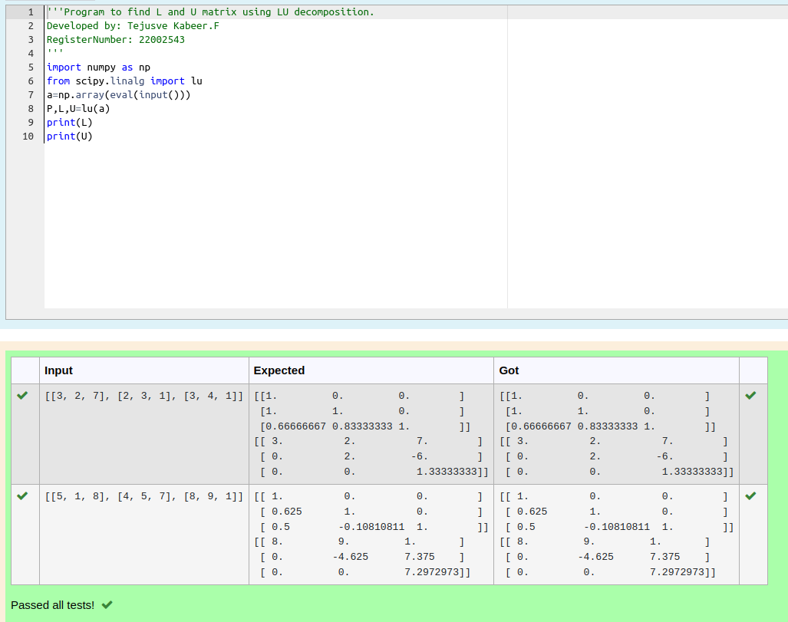
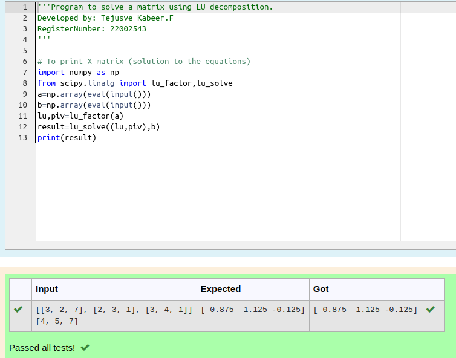

# LU Decomposition 

## AIM:

To write a program to find the LU Decomposition of a matrix.

## Equipments Required:

1. Hardware – PCs
2. Anaconda – Python 3.7 Installation / Moodle-Code Runner

## Algorithm

1. import numpy as np

2. from scipy.linalg import

3. get input from the 

4. End of the program

## Program:
```python
import numpy as np
from scipy.linalg import lu
a=np.array(eval(input()))
P,L,U=lu(a)
print(L)
print(U)
```
(i) To find the L and U matrix
```
/*
Program to find the L and U matrix.
Developed by: Tejusve Kabeer.F
RegisterNumber: 22002543
*/
```
## Output:



## Program:
```python
import numpy as np
from scipy.linalg import lu_factor,lu_solve
a=np.array(eval(input()))
b=np.array(eval(input()))
lu,piv=lu_factor(a)
result=lu_solve((lu,piv),b)
print(result)
```
(ii) To find the LU Decomposition of a matrix
```
/*
Program to find the LU Decomposition of a matrix.
Developed by: Tejusve Kabeer.F
RegisterNumber: 22002543
*/
```
## Output:



## Result:
Thus the program to find the LU Decomposition of a matrix is written and verified using python programming.

